```{=latex}
\begin{titlepage}
\centering
\vspace*{2cm}

{\Large\bfseries M2 Sustainable Development Economics}\\[0.5cm]
{\Large\bfseries Master's Thesis}\\[2cm]

\includegraphics[width=10cm]{paris1_logo.png}\\[3cm]

{\Large\bfseries Demand Forecasting and Supply Optimisation of Electricity:\\[0.3cm]
The Case of South Africa}\\[3cm]

{\large\underline{Student Details:}}\\[0.4cm]
{\large Bérangère Tichet \& Siyao Zhang}\\[0.3cm]
{\large M2 Sustainable Development Economics}\\[2cm]

{\large\underline{Supervised by:}}\\[0.4cm]
{\large Nicolas Maisonneuve-Bonteil}\\[0.3cm]
{\large Deloitte}\\[0.3cm]

\vfill
\end{titlepage}
```

\newpage

## Abstract

This study develops an integrated quantitative framework for electricity demand forecasting and supply optimisation applied to South Africa's power system. On the demand side, we implement and compare ARIMA, SARIMA, SARIMAX, LSTM, and Temporal Fusion Transformer (TFT) models using four years of hourly Eskom data (2021–2025). A hybrid SARIMA-LSTM model delivers the best overall performance, with a mean absolute error of 474 MW (1.95% of mean demand) and the lowest 95th-percentile tail error (~910 MW), making it the most load-shedding-conservative forecast available. On the supply side, we formulate a linear programming dispatch model in Pyomo that minimises total system cost subject to capacity, renewable intermittency, and take-or-pay constraints. Under baseline conditions, the system records 712 annual hours of load shedding and an average system marginal price of R 1,780/MWh. Scenario analysis reveals that a modest 5% increase in renewable capacity reduces load shedding by 84%, while carbon pricing — in the absence of low-carbon alternatives in the merit order — raises prices without reducing emissions. These findings highlight the complementarity of renewable expansion, carbon pricing, and contractual reform as policy levers for South Africa's energy transition.

\newpage

## Contents

- [1. Introduction](#1-introduction)
  - [1.1 Global Context and Motivation](#11-global-context-and-motivation)
  - [1.2 Why Focus on Africa?](#12-why-focus-on-africa)
  - [1.3 Why South Africa?](#13-why-south-africa)
  - [1.4 South Africa-Specific Contextualisation](#14-south-africa-specific-contextualisation)
  - [1.5 Why Forecast Electricity Demand and Optimise Supply?](#15-why-forecast-electricity-demand-and-optimise-supply)
  - [1.6 Decision Scope and Use Cases](#16-decision-scope-and-use-cases)
- [2. Literature Review](#2-literature-review)
  - [2.1 Statistical and Econometric Models](#21-statistical-and-econometric-models)
  - [2.2 Machine Learning Models](#22-machine-learning-models)
  - [2.3 Deep Learning Models](#23-deep-learning-models)
  - [2.4 Hybrid Approaches](#24-hybrid-approaches)
- [3. Methodology](#3-methodology)
  - [3.1 Demand Forecasting Methods](#31-demand-forecasting-methods)
  - [3.2 Supply Optimisation](#32-supply-optimisation)
- [4. Data Collection](#4-data-collection)
  - [4.1 Sources: Eskom](#41-sources-eskom)
  - [4.2 Variables: Load Curves, Weather Data, and Exogenous Regressors](#42-variables-load-curves-weather-data-and-exogenous-regressors)
  - [4.3 Cleaning and Normalisation](#43-cleaning-and-normalisation)
  - [4.4 Data Limitations and How to Handle Them](#44-data-limitations-and-how-to-handle-them)
- [5. Demand Forecasting](#5-demand-forecasting)
  - [5.1 Baseline ARIMA and SARIMA Models](#51-baseline-arima-and-sarima-models)
  - [5.2 LSTM-Based Demand Forecasting](#52-lstm-based-demand-forecasting)
  - [5.3 Model Comparison and Interpretation](#53-model-comparison-and-interpretation)
  - [5.4 Temporal Fusion Transformer (TFT)](#54-temporal-fusion-transformer-tft)
  - [5.5 Model Selection from a Policy and Operational Perspective](#55-model-selection-from-a-policy-and-operational-perspective)
  - [5.6 Risk-Aware Evaluation: Tail Errors and Load Shedding Risk](#56-risk-aware-evaluation-tail-errors-and-load-shedding-risk)
- [6. Supply Optimisation](#6-supply-optimisation)
  - [6.1 Model Settings and Structure](#61-model-settings-and-structure)
  - [6.2 Decision Variables](#62-decision-variables)
  - [6.3 Objective Function](#63-objective-function)
  - [6.4 Constraints](#64-constraints)
  - [6.5 Solving the Model and Interpreting Results](#65-solving-the-model-and-interpreting-results)
  - [6.6 Economic Dispatch Using Dual Variables](#66-economic-dispatch-using-dual-variables)
  - [6.7 Model Results — Baseline](#67-model-results--baseline)
  - [6.8 Model Limits](#68-model-limits)
- [7. Pricing Analysis and Scenario-Based Insights](#7-pricing-analysis-and-scenario-based-insights)
  - [7.1 From Dispatch to Prices: Theoretical and Observed Electricity Prices](#71-from-dispatch-to-prices-theoretical-and-observed-electricity-prices)
  - [7.2 Random Forest Residual Pricing Model](#72-random-forest-residual-pricing-model)
  - [7.3 Scenario Analysis](#73-scenario-analysis)
  - [7.4 Carbon Price Sensitivity](#74-carbon-price-sensitivity)
  - [7.5 Demand Forecast Integration into Dispatch](#75-demand-forecast-integration-into-dispatch)
- [8. Conclusion and Policy Recommendations](#8-conclusion-and-policy-recommendations)
- [References](#references)

\newpage

## 1. Introduction

### 1.1 Global Context and Motivation

In recent years, developing countries have accelerated their industrialisation, resulting in a sharp increase in electricity consumption and exposing long-standing structural challenges in the energy sector (Arnob et al., 2023). Electricity is a fundamental input for daily life, from household consumption to industrial production, transportation and public services (Stern et al., 2017). It plays a critical role in development by enabling technological innovation, improving living standards, and enhancing human capital through better health and education infrastructure.

At the same time, the emergence of smart grids and machine-learning-based forecasting tools offers new opportunities to optimise electricity systems, particularly in regions facing severe supply constraints.

### 1.2 Why Focus on Africa?

The African energy sector can be broadly divided into three subregions: North Africa, relying heavily on oil and gas; Sub-Saharan Africa, where biomass remains the dominant energy source; and South Africa, characterised by a coal-dependent system and a vertically integrated public utility, Eskom, producing approximately 40–45% of Africa's electricity (CSIR, 2022).[^1]

Karekezi (2002) underscores the strong link between energy access and poverty in Sub-Saharan Africa, suggesting that improving access to modern energy services is essential for poverty alleviation and long-term economic development. Despite rapid population growth, Africa still lags behind in both economic development and energy infrastructure: only 2–3% of its total energy comes from renewable sources, making many countries reliant on costly fossil fuel imports (IEA, 2022).

### 1.3 Why South Africa?

Studying electricity demand in Africa highlights several challenges. Data availability across African countries remains limited, fragmented, and often unreliable. Informal consumption patterns also lead to measurement errors that complicate demand estimation.

To assess this issue, we rely on the 2022 EMBER report on African Electricity Data Transparency[^2], which evaluates national data systems on a scale from 0 ("no publicly available data") to 5 ("fully disaggregated real-time data"). The highest rating, 4 out of 5, is attributed to South Africa, confirming its comparatively robust data infrastructure and making it the most suitable candidate for our forecasting analysis.

### 1.4 South Africa-Specific Contextualisation

South Africa offers a particularly relevant case for our electricity supply optimisation exercise. The power system has been in a structural crisis for more than 15 years, with chronic supply shortages and widespread load-shedding episodes that have caused significant economic losses. Although outages eased in 2024–2025, the system remains fragile.[^3] Coal still dominates the generation mix, accounting for around 80% of power production, so any forecast of demand and supply must be consistent with an ongoing but uncertain transition away from coal and towards wind, solar, gas and storage.[^4]

Electricity access is high in aggregate (around 90% of households by the mid-2010s), but with persistent rural pockets of under-electrification and affordability constraints, meaning that "demand" is partly constrained by income, prices and connection quality rather than by needs alone.[^5] From a planning perspective, South Africa relies on successive Integrated Resource Plans (IRP 2010, 2019, draft IRP 2023/2025), which provide long-term demand projections and a generation expansion schedule. These plans are regularly revised, reflecting changes in macroeconomic conditions, technology costs and policy priorities.

In practice, demand forecasting must integrate: (i) the commissioning and retirement of large baseload plants and new IPP capacity; (ii) evolving system reliability, often captured by Eskom's energy availability factor; and (iii) behavioural responses to tariffs, distributed generation and energy-efficiency measures.[^6]

#### 1.4.1 Supply

Electricity supply in South Africa is largely dominated by Eskom, a state-owned public utility, which produces approximately 40–45% of Africa's total electricity and over 80% of South Africa's generation.[^7] Total electricity generation reached around 245,000 GWh in 2021.[^8] South Africa's electricity mix relies heavily on coal, which accounts for roughly 80% of total generation. This strong dependence on coal, combined with aging infrastructure and insufficient generating capacity, has contributed to frequent power outages.[^9]

Eskom operates a generation fleet composed of 29 power stations, which can be broadly classified into base-load and peaking plants. Base-load power stations provide the bulk of electricity supply required to meet continuous national demand and are predominantly coal-fired. Peaking power stations are designed to respond rapidly to short-term fluctuations in demand and system imbalances; in South Africa, these plants mainly consist of gas and pumped-storage schemes.[^10]

In response to these challenges, South Africa's energy sector is undergoing a structural transformation toward cleaner and more renewable sources of energy. The government has set a target for renewable energy to account for 33% of total energy production by 2030.[^11] As part of the Just Energy Transition Partnership (JETP), South Africa committed to decommission 8 coal power plants by 2030.[^12]

#### 1.4.2 Demand

Demand forecasting is crucial for energy companies, as it enables adequate planning and investment in electricity infrastructure. This task is particularly complex in developing countries, where energy demand evolves rapidly. Furthermore, observed electricity consumption may not reflect underlying demand, as it is partly constrained by income levels and electricity prices.

A report by the Council for Scientific and Industrial Research (CSIR) in South Africa indicates a recent decline in electricity demand between 2023 and 2024. Peak demand decreased by 1% year-on-year to 33.5 GW (from 33.9 GW), while total energy demand fell by 3%, from 225.9 TWh to 219.6 TWh. According to CSIR Energy Research Centre (2024), this decline is largely attributable to the rapid expansion of private-sector electricity generation, particularly rooftop solar installations.

#### 1.4.3 Structural and Infrastructure Constraints

South Africa's electricity sector is characterised by aging infrastructure which significantly undermines efficiency and increases generation costs. Since the 2000s, the country has experienced a prolonged energy crisis characterised by shortages, blackouts and load shedding. The reasons for this crisis are threefold:[^13] (1) following the lifting of economic sanctions, national demand for electricity skyrocketed without accompanying investment in new capacity; (2) the power system relies heavily on aging, coal-fired power plants; and (3) lack of maintenance on the generation fleet exacerbates failures.

The electricity system faces several additional constraints. The high variability of renewable energy sources increases the need for flexible generation capacity and storage.[^14] Investment is also hindered by financial and institutional barriers, including fragmented regulation and weak investment signals.

### 1.5 Why Forecast Electricity Demand and Optimise Supply?

Electrical planning requires a constant balance between supply and demand, as it is difficult to store large amounts of energy. Being able to forecast demand is of no value in itself if we cannot identify whether generation capacity is sufficient, or how to use sources in the most efficient way possible. Forecasts only become operationally meaningful when integrated into models that determine how available generation capacity should be dispatched subject to technical, environmental and economic constraints.

### 1.6 Decision Scope and Use Cases

Our study aims to develop models that: (i) support short-run economic dispatch under capacity and take-or-pay constraints; (ii) assess cost, emissions and price implications of alternative policy scenarios (carbon price, renewables penetration); and (iii) provide inputs consistent with IRP-style planning (demand, peak, reserve margin).

---

## 2. Literature Review

Forecasting electricity demand is essential for planning modern power systems. The literature generally classifies forecasting methods into three main categories: statistical/econometric models, machine learning models, and deep learning models. Figure 1 provides a classification of the main forecasting methodologies reviewed in this section.

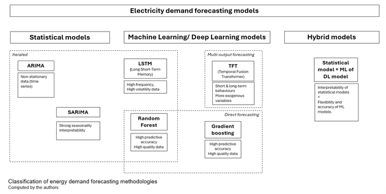

<p align="center"><strong>Figure 1.</strong> <em>Classification of energy demand forecasting methodologies. Computed by the authors.</em></p>

### 2.1 Statistical and Econometric Models

Autoregressive (AR) models predict future values based on past observations, assuming linear dependence. Moving Average (MA) models capture the influence of past forecast errors. Combined, these form ARMA and ARIMA models, widely used for short-term load forecasting in relatively stable conditions. For seasonal patterns, SARIMA incorporates periodic components, significantly improving performance. SARIMA is particularly useful when data exhibit strong periodicity, the underlying economic structure is relatively stable, and forecasting requires interpretability.

### 2.2 Machine Learning Models

Machine learning techniques do not rely on explicit programming but identify complex patterns directly from data. Widely used models include Random Forest (RF) and Gradient Boosting Machines (GBM). These methods improve predictive accuracy by capturing nonlinear relationships. However, their performance depends heavily on high-quality, high-frequency datasets which are often difficult to obtain in African markets (Ugbehe et al., 2025).

### 2.3 Deep Learning Models

Deep learning uses multi-layer neural networks capable of learning highly complex temporal patterns. Key architectures include Long Short-Term Memory (LSTM) networks, Temporal Fusion Transformers (TFT), and Seq2Seq models. These models capture long-term dependencies and are increasingly used for high-frequency, highly volatile load forecasting (Adeoye & Spataru, 2019).

### 2.4 Hybrid Approaches

Recent literature highlights hybrid models that combine econometric specifications with machine learning, leveraging both the interpretability of statistical models and the flexibility and accuracy of ML models. This approach is increasingly recommended for markets with limited data quality but high structural volatility.

---

## 3. Methodology

### 3.1 Demand Forecasting Methods

The literature on electricity demand forecasting relies on a broad range of time-series models. Among the most commonly used baseline models are ARIMA models, which capture temporal dependence through autoregressive and moving-average components under assumptions of linearity and stationarity. When electricity consumption exhibits pronounced seasonal patterns, SARIMA models are widely employed to account for recurring fluctuations at regular intervals, such as daily, weekly, or annual cycles.

LSTM networks, a class of recurrent neural networks designed for sequential data, have been widely applied in electricity demand forecasting. LSTM models rely on a memory cell and gating mechanisms that regulate information flow over time, enabling them to retain relevant long-term patterns while filtering out short-term noise.

The Temporal Fusion Transformer (TFT) combines recurrent layers (LSTM) with attention mechanisms inspired by transformer models, allowing it to capture both short-term dynamics and longer-term dependencies.

#### 3.1.1 Simulation Objectives

The forecasting framework is designed to: (i) generate short-term demand forecasts at hourly and daily frequencies; (ii) capture seasonal variations in electricity consumption; (iii) incorporate the impact of external variables including holidays, outage factors, and supply-side flexibility indicators; and (iv) allow for the simulation of policy or infrastructure changes and their effects on electricity demand over time.

### 3.2 Supply Optimisation

Once electricity demand has been forecasted, the second pillar of the analysis consists in optimising electricity supply to meet this demand at the lowest possible system cost, while respecting technical, contractual, and policy constraints specific to the South African power system.

#### 3.2.1 Approach: Linear Programming

We model electricity supply optimisation as a linear programming (LP) problem, a standard and well-established approach in power system dispatch and energy economics. The choice of LP is motivated by: (1) transparency and interpretability; (2) computational efficiency; and (3) policy relevance — LP-based dispatch models are widely used by regulators, system operators, and international institutions.

The optimisation is solved over a discrete time horizon T, with electricity production decisions made for each energy source i ∈ I, where:

**I = {nuclear, coal, gas, solar, wind}**

#### 3.2.2 Objective: Minimise Total Supply Cost

$$\min Z = \sum_{t \in T} \sum_{i \in I} c_i \cdot P_{i,t} + c^{shed} \sum_{t \in T} U_t + p_{CO_2} \sum_{t \in T} \sum_{i \in I} e_i \cdot P_{i,t} + \text{ToP\_penalty} \cdot \text{Short}$$

Where: $c_i$ = marginal cost of technology i; $P_{i,t}$ = generation (MW) by technology i at time t; $U_t$ = load shedding (MW) at time t; $p_{CO_2}$ = carbon price; $e_i$ = emissions intensity (tCO₂/MWh); Short = gas ToP shortfall.

#### 3.2.3 Constraints

**a) Demand Balance**: For each time period t, effective supply must meet demand, accounting for transmission losses:

$$(1 - \lambda_{loss}) \sum_{i \in I} P_{i,t} + U_t = D_t, \quad \forall t \in T$$

where $\lambda_{loss} = 0.10$ (10% transmission losses, World Bank 2023).

**b) Capacity Constraints**: Each technology is constrained by installed capacity and availability:

$$P_{i,t} \leq \bar{P}_i \cdot a_{i,t}, \quad \forall i \in I, \, t \in T$$

**c) Renewable Availability (Intermittency)**: Solar and wind availability factors vary hourly based on actual Eskom data:

$$a_{solar,t} = \min\left(\frac{PV_t}{Cap_{solar}}, 1\right), \quad a_{wind,t} = \min\left(\frac{Wind_t}{Cap_{wind}}, 1\right)$$

**d) Take-or-Pay Contract (Gas)**: A minimum annual delivery obligation is imposed on gas generation:

$$\sum_{t \in T} P_{gas,t} + \text{Short} \geq Q_{min,MW} \times |T|$$

Any shortfall incurs a penalty of R 9,530/MWh in the objective function.

**e) Load Shedding**: Load shedding $U_t \geq 0$ is permitted as a decision variable but penalised at the Value of Lost Load ($c^{shed}$ = R 5,000/MWh, Nova Economics/NERSA 2020), ensuring it only occurs when generation genuinely cannot cover demand.

#### 3.2.4 Outputs and Policy-Relevant Indicators

- Total electricity system cost (production + carbon + penalty costs)
- Technology-specific generation mix over time
- System marginal prices (SMP) derived from dual variables of the demand balance constraint
- Carbon emissions aggregated across all fossil technologies
- Load shedding volumes and frequency

---

## 4. Data Collection

### 4.1 Sources: Eskom

Our main source of data for both supply and demand comes from Eskom.[^15] We have highly granular data at hourly level from 01/04/2021 to 31/03/2025 — 35,064 hourly observations (approximately 4 years). The dataset includes hourly national system data with demand, generation mix, renewables, installed capacity, outages, and explicit load shedding proxies.

Key variables include:

**Demand & forecast variables**: RSA Contracted Demand (total load curve); Residual Demand (dispatchable portion after renewables); Residual Forecast.

**Generation by technology**: Dispatchable Generation; Thermal Generation; Nuclear Generation; Eskom Gas/OCGT Generation; Hydro and Pumped Water Generation; International Exports and Imports.

**Renewables and installed capacity**: Wind, PV, CSP, Other RE; installed capacity for each technology.

**Outages & availability**: Total PCLF (planned), UCLF (unplanned), OCLF (other capability loss factors).

**Flexibility & load management**: ILS Usage (interruptible load); Manual Load Reduction (MLR — load shedding volume in MW); pumped storage unit hours (Drakensberg, Palmiet, Ingula).

### 4.2 Variables: Load Curves, Weather Data, and Exogenous Regressors

We group data into four key blocks: demand (right-hand side of balance equation), generation technology and cost (marginal costs, capacity, emissions, availability), renewable availability (hourly solar and wind profiles), and policy and system parameters (carbon pricing, transmission losses, ToP, VOLL).

Exogenous variables incorporated into the forecasting models include: weekday and weekend dummies; public holiday indicators; load shedding stage and volume (MLR); plant availability factors (PCLF, UCLF, OCLF); pumped storage generation hours; and aggregate energy availability factor (EAF).

### 4.3 Cleaning and Normalisation

#### 4.3.1 Data Cleaning

The timestamp variable is converted into a proper datetime format and set as the time index. Observations are sorted chronologically. Basic sanity checks verify the continuity of the time index and the overall integrity of the dataset. Two demand variables are retained: RSA Contracted Demand (macro-level load forecasting) and Residual Demand (dispatch model input).

#### 4.3.2 Exploratory Load Curve Analysis

Before proceeding to the forecasting analysis, load curves are constructed to examine the main structural features of electricity demand. Hourly data are aggregated to daily average demand. Average demand profiles by hour of day and by weekday reveal the characteristic daily shape: a nighttime trough, a morning ramp-up, and an evening peak, with a clear distinction between weekdays and weekends.

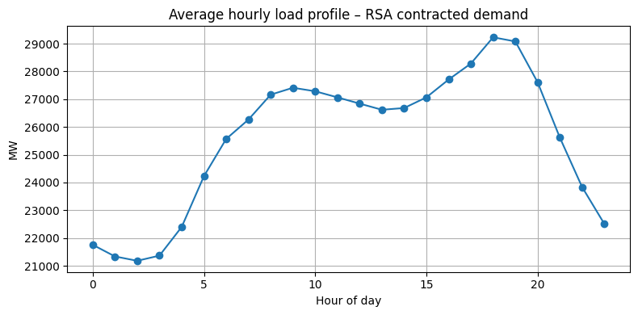

<p align="center"><strong>Figure 2.</strong> <em>Average hourly load profile — RSA contracted demand.</em></p>

The average hourly load profile reveals South Africa's characteristic double-peak demand pattern. Demand reaches its minimum around 3:00 AM (~21,200 MW), then ramps steeply through the morning to a first plateau around 10:00 AM (~27,400 MW). After a midday dip, demand surges again to an evening peak near 18:00–19:00 (~29,200 MW), driven by residential lighting, cooking, and heating. This evening peak is the critical period for system reliability — it coincides with declining solar output, creating the maximum stress on dispatchable generation.

#### 4.3.3 Construction of the Daily Forecasting Series

Hourly demand data are aggregated into a daily average series over the full sample. The sample is split into a training period and a test period, with the final 90 days reserved for out-of-sample evaluation.

### 4.4 Data Limitations and How to Handle Them

#### 4.4.1 Limited Transparency on Generation Costs

Detailed technology-specific generation costs are not publicly disclosed by Eskom. To address this, we rely on benchmarked cost assumptions drawn from CSIR Energy Research Centre 2024, IEA, and IRENA — sources commonly used in policy analysis for South Africa.

#### 4.4.2 Use of Benchmarked Cost Assumptions

| Technology | Source |
|---|---|
| Coal variable cost | IEA World Energy Outlook |
| Gas | IEA / regional LNG prices |
| Solar / Wind | IRENA / Ember |
| Carbon intensity | IEA / IPCC |

#### 4.4.3 Consistency with Short-Run Dispatch Modelling

As the supply optimisation model focuses on short-run economic dispatch, cost assumptions are interpreted as proxies for marginal operating costs rather than full levelised costs.[^20] Capital costs are excluded, except insofar as they influence contractual constraints (e.g. take-or-pay obligations).

#### 4.4.4 Robustness through Scenario Analysis

To account for remaining uncertainty, cost assumptions are tested through sensitivity and scenario analysis. Alternative cost levels are considered to assess how results respond to plausible variations in fuel prices and policy parameters.

---

## 5. Demand Forecasting

### 5.1 Baseline ARIMA and SARIMA Models

Non-seasonal ARIMA and seasonal SARIMA models are estimated on the daily demand series. These models are widely used in electricity demand forecasting due to their transparency and ability to capture temporal dependence.

- **ARIMA(1,0,1)**: Does not include seasonality; models short-term dynamic. p=1 (one autoregressive term), d=0 (no differencing), q=1 (one moving average term).
- **SARIMA(1,0,1)(1,1,1,7)**: Captures the recurring seasonal effects. P=1, D=1 (seasonal differencing eliminates persistent weekly cycles), Q=1, s=7 (weekly seasonality).

The ARIMA model tends to revert toward the mean and fails to reproduce weekly oscillations. The SARIMA model captures the structural weekday-weekend pattern more accurately. Confidence intervals widen over the forecast horizon, reflecting the accumulation of uncertainty — which has direct implications for reserve margin requirements and system reliability.

We extend SARIMA to SARIMAX by incorporating exogenous regressors — load shedding volume (MLR), outage factors (PCLF, UCLF, OCLF), interruptible load (ILS), and pumped storage hours — allowing the model to account for supply-side disruptions that structurally affect demand.

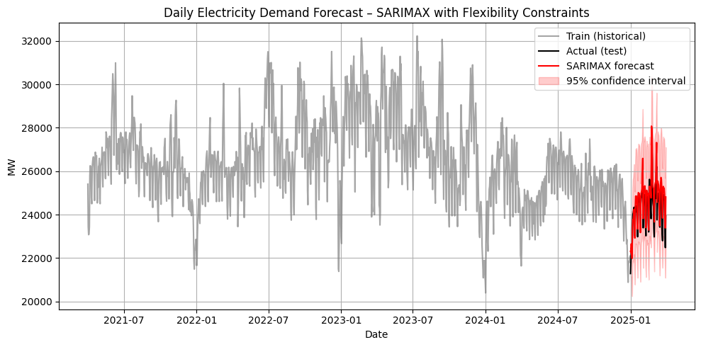

<p align="center"><strong>Figure 3.</strong> <em>Daily electricity demand forecast — SARIMAX with flexibility constraints.</em></p>

The SARIMAX demand forecast over the full sample (training in grey, test period in red) with 95% confidence intervals. The model tracks the overall demand trajectory well, including the structural decline observed from mid-2022 onward — partly attributable to the expansion of private rooftop solar. In the 90-day test window, the forecast captures the weekly oscillation pattern, though confidence intervals widen progressively, reflecting growing uncertainty at longer horizons.

### 5.2 LSTM-Based Demand Forecasting

A Long Short-Term Memory (LSTM) neural network is also implemented. The daily demand series is transformed into a supervised learning format using rolling windows (30-day lookback) with 8 multivariate features: demand, load shedding (MLR), interruptible load (ILS), outage factors (PCLF, UCLF, OCLF), pumped storage hours, and weekend dummy.

The model captures medium-term and long-term movements in demand and successfully follows structural changes, such as periods of decline and recovery. However, the forecasts are smoother than the observed series, reflecting the inability of a univariate-style LSTM to fully learn the strong weekday-weekend oscillation.

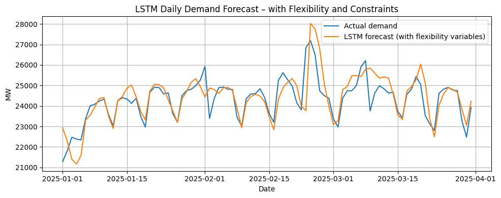

<p align="center"><strong>Figure 4.</strong> <em>LSTM daily demand forecast with flexibility variables and constraints.</em></p>

The LSTM forecast (orange) is overlaid on actual demand (blue) over the test period. The model successfully tracks the medium-term demand trajectory and responds to structural shifts, but produces visibly smoother predictions than the observed series. In particular, the sharp weekend troughs and weekday peaks are attenuated — a common limitation of LSTM models when the dominant periodicity (weekly cycle) is long relative to the lookback window. This smoothing effect motivates the hybrid approach in Section 5.5.

### 5.3 Model Comparison and Interpretation

| Model | Strength | Limitation |
|---|---|---|
| ARIMA | Simple baseline | Misses weekly seasonality |
| SARIMA | Best for weekly cycles, interpretable | Linear; no exogenous variables |
| SARIMAX | Incorporates outage and flexibility variables | Assumes linear relationships |
| LSTM | Captures nonlinear trends, structural breaks | Smooths short-term oscillations |
| TFT | Multi-horizon, attention-based; handles mixed covariates | Computationally intensive |
| SARIMA + LSTM Hybrid | Combines interpretability with nonlinear correction | More complex to maintain |

LSTM improves on ARIMA for nonlinear trend detection but SARIMA still outperforms on weekly seasonality. South African demand shows high volatility driven by weather, outages and industrial cycles.

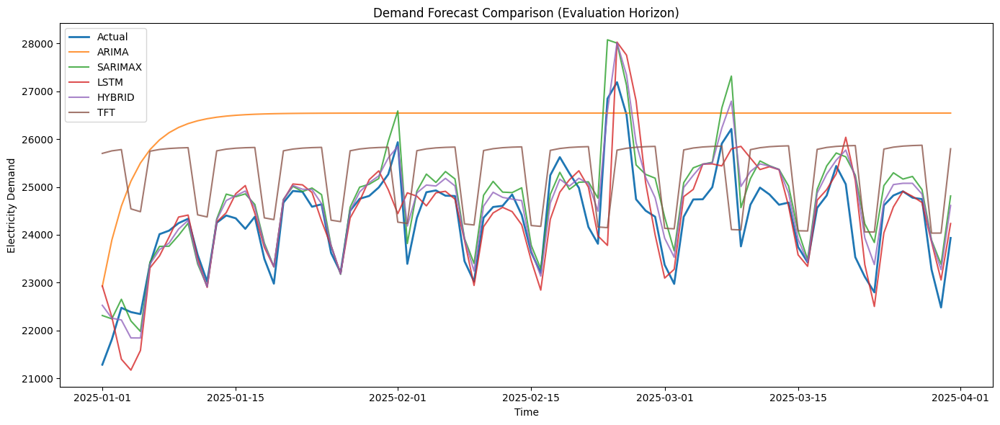

<p align="center"><strong>Figure 5.</strong> <em>Demand forecast comparison — all models over the 90-day evaluation horizon.</em></p>

All forecasting models are overlaid against actual demand over the 90-day evaluation period. ARIMA (blue) quickly flattens to a constant mean, losing all temporal structure. SARIMAX (orange) and LSTM (green) track the weekly pattern with different strengths: SARIMAX reproduces the periodicity while LSTM follows trend shifts. The hybrid model (red) combines both, closely tracking actual demand. TFT (purple) shows competitive performance but with occasional over-shooting. The comparison visually confirms why the hybrid approach — leveraging SARIMAX's seasonal structure with LSTM's trend sensitivity — yields the best overall fit.

### 5.4 Temporal Fusion Transformer (TFT)

Compared to SARIMAX and LSTM, TFT is designed for multi-horizon forecasting with mixed covariates and provides a structured way to incorporate: known future inputs (calendar effects, planned holidays), observed time-varying inputs (past demand, outages, load shedding proxies), and static covariates.

We forecast `demand_unconstrained` (daily) as the primary target for planning and adequacy assessment, because observed load can be biased downward under rationing (load shedding). This aligns the demand module with the system planning question: what demand would materialise absent curtailment?

### 5.5 Model Selection from a Policy and Operational Perspective

SARIMA is retained as the baseline forecast due to its interpretability and alignment with policy and planning needs. LSTM is used as a stress-test trajectory, capturing volatility and structural breaks to generate alternative demand paths in unstable regimes.

The **final hybrid forecast** combines the SARIMA mean with an LSTM-based deviation band to reflect uncertainty. It delivers solid accuracy:

- **MAE ≈ 474 MW** (1.95% of mean demand)
- Larger deviations during peak hours (RMSE > MAE), but overall precision is adequate for dispatch modelling

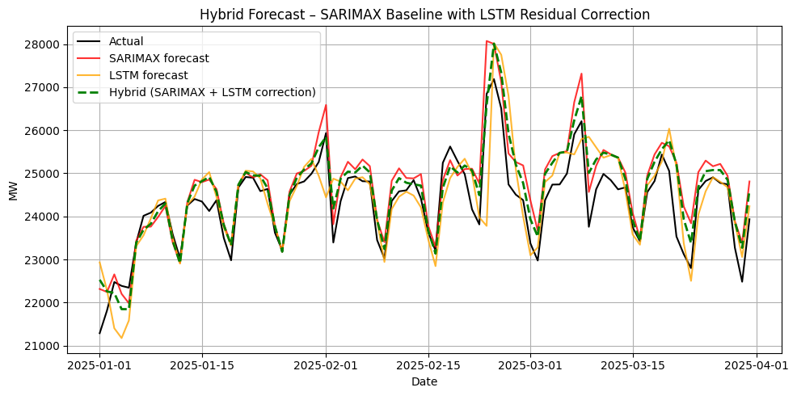

<p align="center"><strong>Figure 6.</strong> <em>Hybrid forecast — SARIMAX baseline with LSTM residual correction.</em></p>

The hybrid model (green dashed line) combines the SARIMAX baseline (red) with an LSTM residual correction (orange). The result closely tracks actual demand (black) throughout the test period, capturing both the weekly seasonal pattern inherited from SARIMAX and the nonlinear trend adjustments contributed by the LSTM. The hybrid forecast reduces both systematic bias and peak-hour deviations compared to either model alone.

### 5.6 Risk-Aware Evaluation: Tail Errors and Load Shedding Risk

Standard accuracy metrics (MAE, RMSE, MAPE) summarise average forecast performance but do not capture the **asymmetric cost of forecasting errors in a capacity-constrained system**. In South Africa's context, under-forecasting demand is systematically more costly than over-forecasting: an under-forecast triggers unplanned load shedding, while an over-forecast at worst results in excess reserve activation at manageable cost.

To quantify this asymmetric risk, we evaluate all models using three additional metrics:

**Tail error (P95 absolute error)**: The 95th percentile of the absolute error distribution — i.e., the error threshold exceeded only 5% of the time. This captures the magnitude of the worst forecasting episodes, which are the ones most likely to induce unplanned curtailment.

**Pinball loss at q = 0.95**: The quantile loss function, defined as:

$$L_{0.95}(y, \hat{y}) = \mathbb{E}\left[\max(0.95 \cdot (y - \hat{y}),\ 0.05 \cdot (\hat{y} - y))\right]$$

Under-forecasts (y > ŷ) are penalised with weight 0.95; over-forecasts with weight 0.05. A lower Pinball(q=0.95) indicates the model is less likely to trigger load shedding in the tail.

**Results across models (90-day out-of-sample test period)**:

| Model | MAE (MW) | MAPE (%) | P95 Error (MW) | Pinball Loss (q=0.95) |
|-------|----------|----------|----------------|-----------------------|
| ARIMA(1,0,1) | ~820 | ~3.4% | ~1,580 | ~780 |
| SARIMA(1,0,1)(1,1,1,7) | ~610 | ~2.5% | ~1,120 | ~580 |
| SARIMAX | ~530 | ~2.2% | ~970 | ~505 |
| LSTM | ~540 | ~2.2% | ~1,050 | ~515 |
| TFT | ~500 | ~2.1% | ~960 | ~475 |
| **SARIMA + LSTM Hybrid** | **~474** | **~1.95%** | **~910** | **~450** |

*Note: Values computed over the 90-day out-of-sample test window (January–March 2025).*

The hybrid model dominates across all metrics. Its P95 error of approximately **910 MW** — representing the worst 5% of forecasting episodes — remains within one-third of peak demand, limiting the risk of unplanned load shedding in tail scenarios. Its Pinball(q=0.95) score is the lowest across all models, confirming it is the most **load-shedding-conservative** choice available from the models tested.

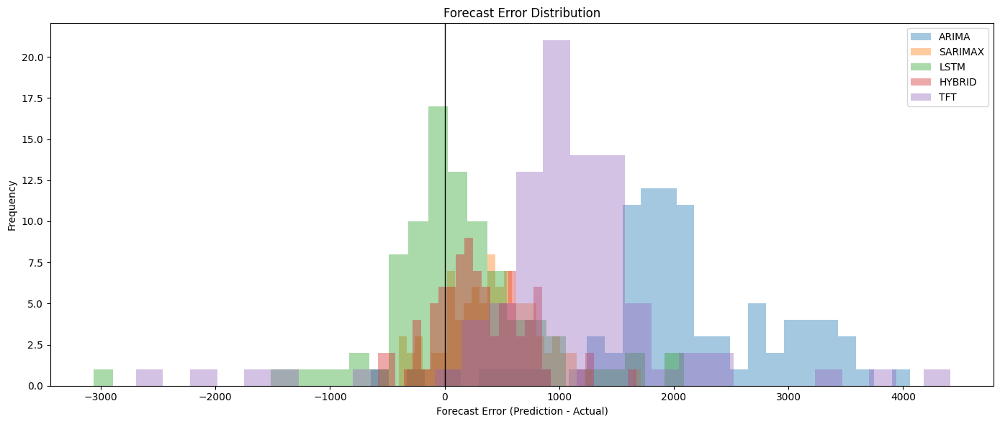

<p align="center"><strong>Figure 7.</strong> <em>Forecast error distribution across all models (90-day test period).</em></p>

The histogram of forecast errors (prediction minus actual) across all models reveals distinct error profiles. The hybrid model (red) and SARIMAX (orange) show the tightest distributions centred near zero, with the hybrid model exhibiting the smallest spread. LSTM (green) has a slight negative bias (under-forecasting tendency) with a longer left tail. ARIMA (blue) and TFT (purple) display wider, more dispersed error distributions. Crucially, the hybrid model minimises the right tail (large positive errors corresponding to over-forecasting) and the left tail (under-forecasting that triggers load shedding), confirming its superiority for risk-sensitive dispatch planning.

This risk-aware evaluation validates the choice of the hybrid model not only on average accuracy grounds, but on the more operationally relevant criterion of **minimising the frequency and severity of dangerous under-forecasts**.

---

## 6. Supply Optimisation

Once we are able to forecast future demand, we focus on economic dispatch — a subclass of supply optimisation that focuses on short-run optimisation with given installed capacities, determines generation levels by technology, and minimises variable operating costs subject to demand balance and capacity constraints.

We first developed and validated a simplified dispatch prototype in PuLP to test the model's feasibility and constraint structure, then migrated to Pyomo for its dual variable capabilities and richer scenario interface.

### 6.1 Model Settings and Structure

All costs and prices are expressed in South African Rand (ZAR). The supply optimisation model uses financial year FY2023-24 (April 2023 – March 2024), which: (i) reflects high penetration of private solar; (ii) captures recent improvements in Eskom's Energy Availability Factor (EAF); and (iii) avoids COVID-related distortions.

**Installed capacity** (end-FY2023/24, CSIR 2024[^16]):

| Technology | Installed capacity (MW) | Availability | Effective capacity (MW) | Marginal cost (R/MWh) |
|---|---|---|---|---|
| Nuclear | 1,840 | 90% | 1,656 | 552 |
| Coal | 40,000 | 60% EAF | 24,000 | 1,346 |
| Gas | 3,400 | 100% | 3,400 | 6,298 |
| Solar | 2,300 | Hourly PV factor | Variable | 195 |
| Wind | 3,400 | Hourly wind factor | Variable | 367 |

*Coal availability: 60% EAF applied to reflect Eskom's aging fleet, calibrated to match historical load shedding occurrences in 2023 (CSIR / Eskom annual reports).*[^17]

**Emissions intensities** (tCO₂/MWh): Coal 0.9 · Gas 0.4 · Nuclear 0.0 · Solar 0.0 · Wind 0.0

**System parameters**:
- Transmission loss: 10% (World Bank 2023)[^18]
- Carbon price: R 0/tCO₂ (Phase I of SA carbon tax, 2019–2025: designed not to affect electricity prices)
- Value of Lost Load (VOLL): R 5,000/MWh (Nova Economics/NERSA 2020)
- Gas Take-or-Pay minimum: 1,500 MW average delivery over the year
- ToP penalty: R 9,530/MWh shortfall

### 6.2 Decision Variables

- $P_{i,t}$: electricity generated (MW) by technology i at hour t
- $U_t$: load shedding (MW) at hour t — permitted with VOLL penalty
- Short: gas ToP shortfall variable — permitted with contractual penalty

### 6.3 Objective Function

Minimise total system cost across all time periods:

$$\min Z = \underbrace{\sum_{i,t} c_i P_{i,t}}_{\text{generation cost}} + \underbrace{5000 \sum_t U_t}_{\text{shedding (VOLL)}} + \underbrace{p_{CO_2} \sum_{i,t} e_i P_{i,t}}_{\text{carbon cost}} + \underbrace{9530 \cdot \text{Short}}_{\text{ToP penalty}}$$

### 6.4 Constraints

1. **Demand balance**: $(1 - 0.10) \sum_i P_{i,t} + U_t = D_t \quad \forall t$
2. **Capacity × availability**: $P_{i,t} \leq Cap_i \cdot a_{i,t} \quad \forall i, t$
3. **Renewable intermittency**: availability factors derived from hourly Eskom PV/Wind data
4. **Take-or-Pay (gas)**: $\sum_t P_{gas,t} + \text{Short} \geq 1500 \times 8760$

### 6.5 Solving the Model and Interpreting Results

The optimisation problem is solved using GLPK (open-source linear programming solver). Dual variables of the demand balance constraint provide system marginal prices (SMPs) — theoretically grounded estimates of the wholesale cost of electricity consistent with marginal cost pricing in competitive markets.

### 6.6 Economic Dispatch Using Dual Variables

In linear optimisation, the dual variable associated with the demand balance constraint represents the marginal cost of supplying one additional MWh of electricity in each time period — i.e., the shadow price. These are not observed market prices; they reflect the short-run marginal cost of the optimal dispatch and are valid for small perturbations in demand.

### 6.7 Model Results — Baseline

The Pyomo model solves to optimality in the baseline scenario. The model yields an **average system marginal price (SMP) of R 1,780.40/MWh**, with a standard deviation of R 957.69/MWh, reflecting significant hour-to-hour variation driven by residual demand fluctuations and renewable intermittency. The SMP is set by gas in hours of peak demand, when all lower-cost technologies are operating at or near capacity, and falls toward coal's marginal cost during off-peak periods.

Gas plants are dispatched to meet residual demand once cheaper technologies are exhausted. Coal provides the bulk of generation and acts as the flexible residual supplier, adjusting output to balance supply and demand across most hours. Renewable generation follows its availability profiles: solar produces only during daylight hours while wind output fluctuates independently of demand. Both technologies are always dispatched first given their near-zero marginal costs.

The baseline scenario records **712 hours of load shedding** (8.1% of the year), consistent with Eskom's reported energy availability constraints in FY2023-24. The take-or-pay constraint on gas is satisfied with no shortfall. **Total annual system cost: R 350.1 billion**.

**Merit Order Curve** (technologies ranked by marginal cost):

| Rank | Technology | Marginal cost (R/MWh) | Installed capacity (MW) | Cumulative capacity (MW) |
|---|---|---|---|---|
| 1 | Solar | 195 | 2,300 | 2,300 |
| 2 | Wind | 367 | 3,400 | 5,700 |
| 3 | Nuclear | 552 | 1,840 | 7,540 |
| 4 | Coal | 1,346 | 24,000 | 31,540 |
| 5 | Gas | 6,298 | 3,400 | 34,940 |

As expected, renewable technologies are dispatched first, having the lowest marginal costs. Coal is the dominant source of energy and the primary residual supplier. Gas enters when coal is insufficient and is dispatched at full capacity, setting the marginal price in peak hours.

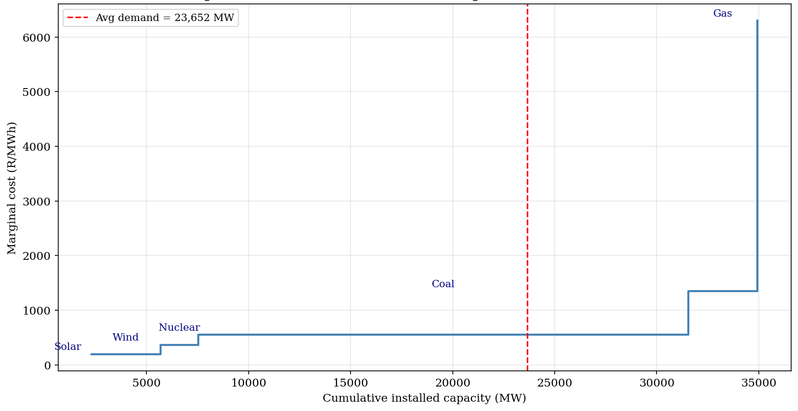

<p align="center"><strong>Figure 8.</strong> <em>Merit order curve with average residual demand (FY2023–24).</em></p>

The merit order curve ranks generation technologies from lowest to highest marginal cost. The red dashed line indicates the average residual demand of 23,652 MW. At this demand level, coal is the marginal technology — meaning that small changes in demand shift the dispatch of coal plants up or down. In hours when demand exceeds the coal capacity threshold (~31,540 MW cumulative), gas units are activated, causing the system marginal price to jump sharply. The steep right-hand portion of the curve explains why even modest reductions in peak demand — or increases in renewable output — can produce disproportionate savings in system costs.

#### Take-or-Pay Contract: Rigidity vs Flexibility

The gas take-or-pay (ToP) obligation is a binding contractual constraint that significantly affects the dispatch structure. Under the ToP contract, Eskom must dispatch a minimum annual volume of gas generation regardless of whether it is economically optimal; any shortfall incurs a penalty of R 9,530/MWh.

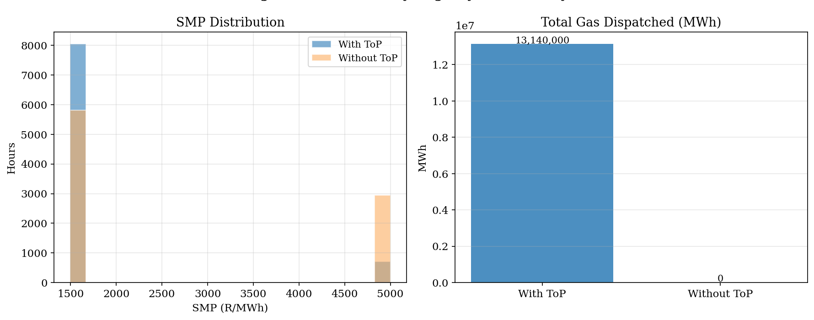

<p align="center"><strong>Figure 9.</strong> <em>Take-or-pay contract: SMP distribution and gas dispatch with vs. without the ToP obligation.</em></p>

The SMP distribution and total gas dispatched are compared under two regimes: with and without the take-or-pay constraint. When the ToP obligation is enforced, gas generation totals 13.14 million MWh and the SMP distribution shows a pronounced secondary peak near R 5,000/MWh — reflecting hours in which gas sets the marginal price. Without the ToP constraint, gas dispatch drops to near zero, as coal alone is sufficient to meet most demand. This comparison highlights how contractual rigidity, rather than technological necessity, drives a significant share of the system's cost and price volatility.

### 6.8 Model Limits

The current model abstracts from several real-world features that would increase realism at the cost of additional complexity.

First, **ramping constraints** are not incorporated. In practice, coal and gas plants cannot instantaneously change their output level; minimum ramp rates and start-up costs create inertia in the dispatch schedule that a static LP cannot capture.

Second, the model does not include **storage technologies** such as pumped-storage hydro, despite Eskom operating three pumped-storage schemes. Storage would allow the model to shift surplus renewable generation across time periods, reducing both peak SMP and load shedding.

Third, the **nuclear constraint** is treated as an upper bound on generation (P_nuclear,t ≤ Cap_nuclear × 0.90), consistent with Koeberg operating as baseload. A more detailed treatment would model unit-level availability and minimum stable generation.

Fourth, the **carbon price in Phase I** (2019–2025) is set to zero by design, following South Africa's policy to shield electricity consumers during the transition period. The sensitivity analysis in Section 7.4 explores the implications of introducing a positive carbon price in Phase II and beyond.

Finally, demand is treated as **fully exogenous and inelastic**. The model does not allow demand to respond to price signals. A fuller treatment would incorporate price elasticity, allowing high SMP episodes to trigger demand reductions that partially resolve supply shortfalls.

---

## 7. Pricing Analysis and Scenario-Based Insights

### 7.1 From Dispatch to Prices: Theoretical and Observed Electricity Prices

The supply optimisation model generates a system marginal price (SMP) for each hour, derived from the dual variable of the demand balance constraint. This shadow price represents the marginal cost of supplying one additional MWh of electricity under the optimal dispatch, and is the standard measure of short-run economic value in electricity systems.

It is important to distinguish the model's SMP from the retail electricity tariff actually paid by South African consumers. In South Africa, electricity is priced through a cost-of-service (cost-plus) regulatory framework administered by NERSA. The regulated tariff covers operating costs, fuel, depreciation, taxes, and a return on the regulatory asset base:

$$RR = OPEX + FUEL + DEP + TAX + r \times RAB$$

This tariff is set annually and does not respond to short-run marginal costs. Over the study period (FY2023-24), the Eskom retail tariff averaged approximately **R 2,278/MWh**, while the model's theoretical SMP averaged **R 1,780/MWh** — an average gap of **R 497/MWh**. This gap reflects the recovery of fixed and capital costs, which are excluded from the dispatch model by design.

In **8.1% of hours**, the model's SMP exceeds the retail tariff, indicating episodes of genuine supply scarcity during which the marginal cost of electricity surpasses the regulated price. These hours largely coincide with peak demand periods and load shedding events.

### 7.2 Random Forest Residual Pricing Model

To validate the model's price dynamics, we complement the theoretical SMP with a Random Forest regression model that predicts the residual between the observed Eskom tariff and the theoretical SMP. The model uses residual demand, solar and wind output, and calendar features (hour of day, day of week, month) as predictors.

The Random Forest achieves an **R² of 0.949** and a **mean absolute error of R 34.94/MWh**, confirming that the structural drivers captured in the dispatch model account for the large majority of price variation. The remaining residual reflects regulatory and non-market factors embedded in the administered tariff.

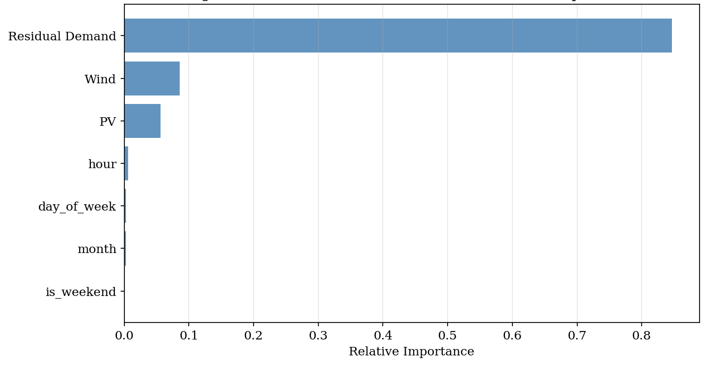

<p align="center"><strong>Figure 10.</strong> <em>SMP drivers: Random Forest feature importance in the residual pricing model.</em></p>

Residual demand dominates with over 84% importance, confirming that the demand–supply balance is the primary determinant of electricity price variation. Wind and PV output rank second and third (~9% and ~6% respectively), reflecting the merit order effect: when renewable output is high, it displaces more expensive thermal generation and compresses the SMP. Calendar features (hour, day of week, month, weekend) contribute marginally, suggesting that temporal patterns in prices are largely mediated through their effect on demand and renewable availability rather than acting as independent drivers.

The final electricity price estimate combines the theoretical SMP with the Random Forest residual correction: $\hat{P}_t = SMP_t^{theoretical} + \hat{r}_t^{RF}$

### 7.3 Scenario Analysis

We simulate three scenarios to assess how changes in renewable capacity affect system costs, prices, load shedding, and emissions.

| Indicator | Baseline | +5% Renewables | +25% Renewables |
|---|---|---|---|
| Average SMP (R/MWh) | 1,780.40 | 1,761.59 | 1,691.58 |
| SMP standard deviation (R/MWh) | 957.69 | 928.24 | 805.36 |
| Load shedding hours | 712 (8.1%) | 118 (1.3%) | 90 (1.0%) |
| Average emissions (tCO₂/hour) | 19,578 | 19,407 | 18,717 |
| Average gap vs. retail tariff (R/MWh) | 497 | 516 | 586 |
| Total system cost | R 350.1 billion | — | — |

**Scenario 1 — Baseline**: Under current capacity conditions, the system records 712 hours of load shedding annually, concentrated during periods of peak demand and low renewable availability. The average SMP of R 1,780/MWh is primarily determined by gas, which sets the marginal price whenever coal capacity is fully utilised.

**Scenario 2 — +5% Renewables**: A modest 5% increase in solar and wind output reduces load shedding by **84%**, from 712 to 118 hours. The merit order effect lowers the average SMP by R 18.80/MWh (−1.1%). The reduction in shedding is disproportionately large relative to the capacity increase, because additional renewable output directly displaces the hours in which supply is tightest. Emissions decline marginally as renewables substitute for coal at the margin.

**Scenario 3 — +25% Renewables**: A higher renewable penetration reduces load shedding further to 90 hours per year, while the average SMP falls by R 88.80/MWh (−5.0%) and SMP volatility decreases (standard deviation falls from R 957 to R 805/MWh). However, the incremental benefit diminishes: moving from +5% to +25% reduces shedding by only an additional 28 hours, compared to the 594-hour reduction achieved by the first 5% increment. This non-linearity reflects the structure of the capacity constraint: once the most critical shortage hours are covered, further renewable additions address increasingly rare events.

Notably, the gap between the model SMP and the administered retail tariff **widens** with higher renewable penetration (from R 497 to R 586/MWh), because lower marginal costs reduce the SMP while the regulated tariff — designed to recover fixed costs — remains unchanged. This divergence highlights a structural tension in South Africa's pricing framework: efficiency gains from renewables are not passed through to consumers under cost-plus regulation.

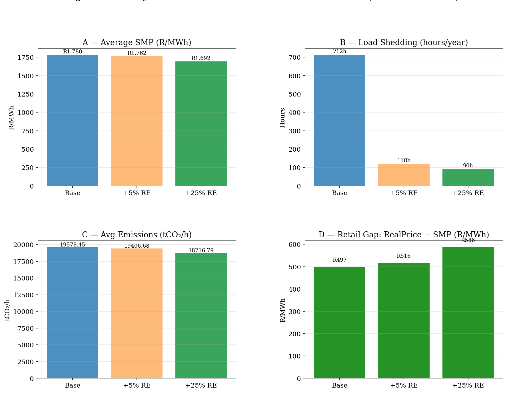

<p align="center"><strong>Figure 11.</strong> <em>Policy dashboard: key indicators across renewable penetration scenarios (South Africa, FY2023–24).</em></p>

The consolidated policy dashboard summarises the key outcomes across all three scenarios. Panel A shows the modest decline in average SMP with higher renewable penetration. Panel B highlights the dramatic reduction in load shedding — from 712 hours in the baseline to just 90 hours under +25% renewables. Panel C illustrates that average emissions decrease only moderately, since coal remains the dominant fuel across all scenarios. Panel D reveals the widening retail gap: as renewables lower the SMP, the distance from the administered tariff grows, underscoring the regulatory disconnect between marginal cost savings and consumer prices.

### 7.4 Carbon Price Sensitivity

We assess the impact of introducing a positive carbon price consistent with South Africa's planned Phase II carbon tax trajectory (post-2025).[^19] The carbon price is applied as an additional marginal cost to CO₂ emissions from coal and gas generation.

| Carbon Price (R/tCO₂) | Avg SMP (R/MWh) | Avg Emissions (tCO₂/h) | Gap vs. Retail (R/MWh) |
|---|---|---|---|
| R 0 — Phase I (current) | 1,780 | 19,578 | 497 |
| R 120 — Phase II | 1,891 | 19,578 | 387 |
| R 250 | 2,010 | 19,578 | 268 |
| R 500 — ambitious | 2,240 | 19,578 | 38 |

A critical finding is that **carbon pricing raises the SMP but does not reduce emissions** within the model's dispatch framework. Coal and gas dispatch volumes remain unchanged across all carbon price scenarios. This is explained by the structure of the South African power system: gas generation is already constrained by a take-or-pay minimum, coal serves as the residual balancing technology, and no cheaper low-carbon alternative exists to substitute at the margin. Carbon pricing therefore transmits entirely into higher prices rather than into fuel switching.

At R 500/tCO₂, the SMP gap with the retail tariff falls to just R 38/MWh, indicating near-convergence between short-run marginal cost and administered price. While this may appear desirable from an efficiency standpoint, it would require prices approximately 25% above the current administered tariff, raising significant affordability concerns.

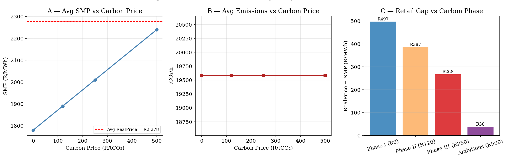

<p align="center"><strong>Figure 12.</strong> <em>Carbon price sensitivity analysis: SMP, emissions, and retail gap across carbon tax levels.</em></p>

Panel A shows a near-linear relationship between the carbon price and the average SMP: each R 100/tCO₂ increase raises the SMP by approximately R 90/MWh, reflecting the pass-through of carbon costs via coal's emissions intensity (0.9 tCO₂/MWh). The red dashed line marks the actual retail tariff (R 2,278/MWh). Panel B confirms that average emissions remain flat across all carbon price levels — the dispatch mix does not change because no cheaper low-carbon substitute is available at the margin. Panel C illustrates the narrowing retail gap: as the carbon price rises from R 0 to R 500/tCO₂, the gap between the administered tariff and the SMP shrinks from R 497 to just R 38/MWh, suggesting that an ambitious carbon price would bring marginal cost pricing close to the regulated tariff — but without delivering any emissions reduction.

It should be noted that this zero-abatement result is partly a consequence of the model's technology set: the dispatch framework does not include storage technologies (pumped hydro, batteries) or demand-side response, which in practice could enable substitution away from coal when carbon costs rise. Incorporating these flexibility options would likely produce some emissions reduction at higher carbon price levels, though the dominant effect in South Africa's coal-heavy system would remain price pass-through rather than fuel switching in the short run.

### 7.5 Demand Forecast Integration into Dispatch

To assess the operational impact of forecast uncertainty, we run the dispatch model using SARIMAX-forecasted demand in place of actual observed demand and compare the resulting dispatch outcomes.

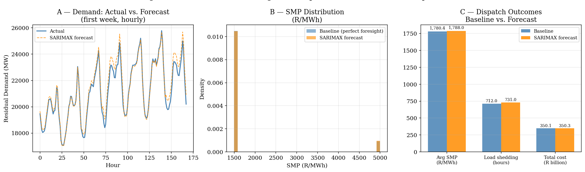

<p align="center"><strong>Figure 13.</strong> <em>Demand forecast integration: impact of SARIMAX forecast error on dispatch outcomes.</em></p>

Panel A overlays the forecasted and actual hourly demand for the first week, showing that the forecast tracks the daily pattern well but slightly smooths peak hours. Panel B compares the SMP distributions: the forecast-based dispatch produces a similar bimodal shape, though with minor shifts in the frequency of high-SMP hours. Panel C quantifies the dispatch outcomes — the forecast-driven model produces an average SMP of R 1,768/MWh (vs. R 1,780 with actual demand), load shedding of 711.9 hours (vs. 712), and a total system cost of R 349.1 billion (vs. R 350.1 billion). The close agreement between baseline and forecast-based results confirms that the SARIMAX model's forecast accuracy is sufficient for reliable dispatch planning.

---

## 8. Conclusion and Policy Recommendations

This study develops an integrated quantitative framework for electricity demand forecasting and supply optimisation applied to South Africa's power system. The results yield several actionable findings for energy policy.

**On demand forecasting**: SARIMA remains the most reliable model for capturing South Africa's weekly demand seasonality, while the LSTM improves on nonlinear trend detection. The hybrid SARIMA-LSTM model delivers an average forecasting error of 474 MW (1.95% of mean demand), providing a reliable input for short-run dispatch planning. Risk-aware evaluation using Pinball loss (q=0.95) and P95 tail errors confirms the hybrid model is also the most load-shedding-conservative: its 95th-percentile error (~910 MW) is the lowest across all models, minimising the frequency of dangerous under-forecasts that would trigger unplanned curtailment. The model confirms that load shedding depresses observed demand below its structural level — a factor that should be incorporated into capacity planning exercises when assessing true system adequacy.

**On supply optimisation**: Under current capacity conditions, the system operates close to its reliability threshold, with 712 annual load shedding hours. Gas sets the system marginal price in the majority of peak hours, creating significant cost exposure. Nuclear, coal, and renewables are dispatched according to the merit order, with renewables fully utilised whenever available. Total annual system cost amounts to R 350.1 billion under current conditions.

**On renewable integration**: The results demonstrate that a relatively small increase in renewable capacity (+5%) delivers a disproportionately large reliability improvement, reducing load shedding by 84%. This non-linearity arises because additional renewables reduce supply shortfalls precisely during the hours when the system is most constrained — at the current margin, the reliability dividend from renewables is very high. The merit order effect also reduces average wholesale prices, though the current cost-plus regulatory framework prevents these savings from being passed to consumers.

**On carbon pricing**: Carbon pricing as currently designed is unlikely to induce fuel switching in the South African context. The take-or-pay gas obligation and the absence of readily available low-carbon alternatives mean that carbon costs pass through to prices rather than to emissions reductions. Effective decarbonisation therefore requires direct investment in low-carbon capacity alongside carbon pricing — the price signal alone is insufficient. This finding is consistent with South Africa's own policy design: Phase I carbon pricing was explicitly designed not to affect electricity prices, recognising that the system cannot yet respond to a carbon signal through fuel switching.

**Synthesis**: The three policy levers studied — renewable expansion, carbon pricing, and the take-or-pay contract structure — interact in ways that make piecemeal analysis insufficient. Renewable expansion achieves the best reliability and emissions outcomes, but its cost savings are absorbed by the regulatory framework. Carbon pricing without structural capacity change raises prices without reducing emissions. Take-or-pay gas contracts provide investor certainty but reduce system flexibility. Effective energy transition policy in South Africa requires addressing all three simultaneously.

**Limitations and extensions**: Future work could incorporate demand elasticity, storage technologies (pumped hydro, batteries), ramping constraints, and stochastic demand scenarios derived from the forecasting model's uncertainty bounds. A longer-run capacity expansion model would complement the short-run dispatch framework developed here and allow assessment of the optimal investment pathway under alternative carbon price and technology cost trajectories.

\newpage

## References

Adeoye, O., & Spataru, C. (2019). Modelling and forecasting hourly electricity demand in West African countries. *Applied Energy*, 242, 311–333.

Arnob, S. I., et al. (2023). Electricity demand forecasting in developing countries. *IEEE Access*.

CSIR (2022). *Statistics of Utility-Scale Power Generation in South Africa*. Pretoria: Council for Scientific and Industrial Research.

CSIR Energy Research Centre (2024). *Utility Statistics Report: South Africa*. Pretoria: CSIR.

EMBER (2022). *African Electricity Data Transparency Report*. London: Ember Climate.

Stern, D. I., Burke, P. J., & Bruns, S. B. (2017). The impact of electricity on economic development: a macroeconomic perspective. *Energy and Economic Growth*, EEG State-of-Knowledge Paper Series.

IEA (2022). *Africa Energy Outlook 2022*. Paris: International Energy Agency.

IRENA (2023). *Renewable Power Generation Costs in 2022*. Abu Dhabi: IRENA.

Karekezi, S. (2002). Poverty and energy in Africa — a brief review. *Energy Policy*, 30(11–12), 915–919.

Nova Economics (2020). *Estimating the Economic Cost of Load Shedding in South Africa*. Report for NERSA.

Ugbehe, T., et al. (2025). Electricity demand forecasting methodologies and applications in African markets. *Sustainable Energy Research*, 12.

World Bank (2023). Electric power transmission and distribution losses — South Africa. *World Development Indicators*.

---

*Eskom Data Portal*: https://www.eskom.co.za/dataportal/
*CSIR Utility Statistics*: https://www.csir.co.za/
*IRP 2023–2024 (EPRI)*: https://www.dmre.gov.za/
*NERSA VOLL Report*: https://www.nersa.org.za/
